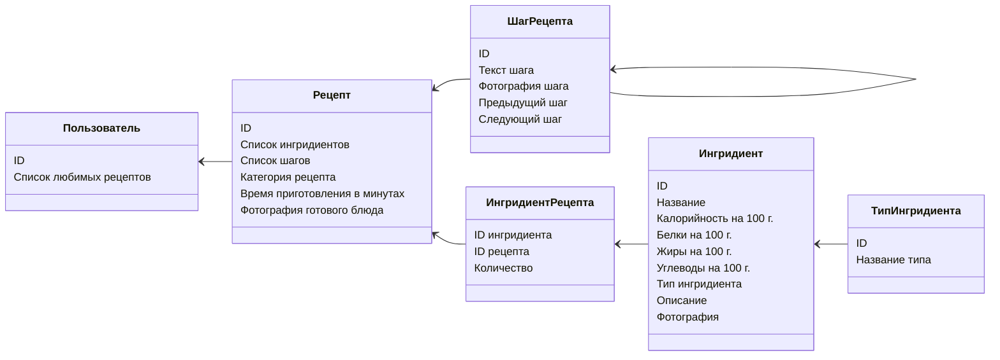

# Kitchen Nightmares

> Чтобы готовить плохо, сначала нужно научиться готовить хорошо! &copy; Шеф всея Руси

Сборник рецептов с возможностью подбора рецептов на основе ингредиентов.

**Автор проекта:** Андреев Николай Владимирович.

[Запустить бота](https://t.me/kitchen_nightmares_bot)

## Диаграмма классов

## Что умеет бот

- [ ] Работа с ингредиентами
  - [ ] Получение информации о КБЖУ продукта по его названию (с поддержкой нечёткого поиска)
  - [ ] Добавление и изменение ингредиентов и информации о них (только для своих ингредиентов)
- [ ] Работа с рецептами
  - [ ] Поиск рецептов по названию и по ингредиентам
  - [ ] Просмотр рецептов по шагам с указанием необходимых ингредиентов
  - [ ] Добавление рецептов в список избранных
  - [ ] Добавление и изменение рецептов и их ингредиентов (только для своих рецептов)

## Основные команды

|    Команда    | Описание                                                     |
|:-------------:|--------------------------------------------------------------|
|   `/start`    | Начало работы с ботом, список основных команд                |
|    `/help`    | Открыть справку по боту и полный список команд с пояснениями |
|   `/recipe`   | Найти рецепт по названию и/или по ингредиентам               |
| `/favourite`  | Открыть список избранных рецептов                            |
| `/ingredient` | Найти ингредиент по названию и все рецепты с ним             |

## Панель управления

Панель управления работает через веб-интерфейс и позволяет удобно редактировать рецепты и ингредиенты, а также смотреть избранные рецепты всех пользователей.

[Ссылка на панель управления](https://www.youtube.com/watch?v=dQw4w9WgXcQ)
